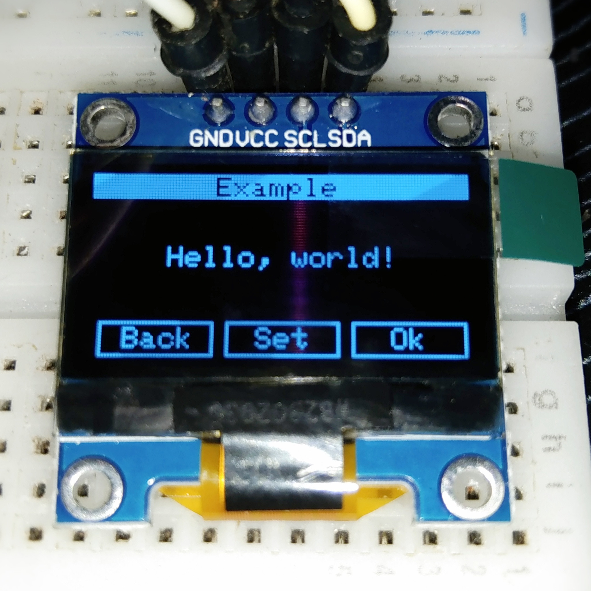
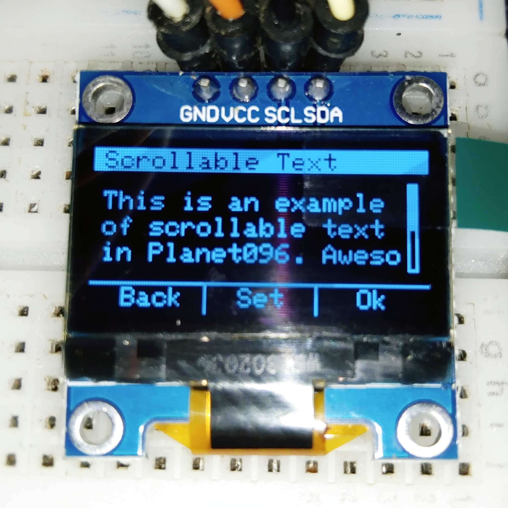

# Planet096 GUI Library

 

Planet096 is an Arduino library designed to simplify the creation of graphical user interfaces (GUIs) on monochromatic OLED displays utilizing the SSD1306 driver. This library provides a flexible framework for constructing scenes and drawing various interactive widgets, enabling users to develop intuitive user interfaces even within the constrained resources of these displays.

- **Scene Creation** - Planet096 introduces the concept of scenes, similar to Android activities, allowing developers to manage different UI screens efficiently.

- **Widget Variety** - The library offers an array of widgets such as bottom menu bars, progress bars, buttons, label texts, scrollable text areas, adjustable sliders, selectable lists, check boxes, and radio buttons, among others.

- **Dependency on Adafruit_SSD1306** - Planet096 builds upon the foundation of the widely-used Adafruit_SSD1306 library, making it easier to integrate into existing projects.

## "Hello, world!" Example

Planet096 restrictively discourages the use of traditional `setup()` and `loop()` in Arduino, hence the `app()` function. The `app()` function is closely similar to the `main()` function of common programming languages.

```cpp
#include <planet096.h>

void app() {
    Planet096Scene scene("Example");
    scene.setAppBarAlignment(PLANET096_APPBAR_ALIGN_CENTER);
    scene.setAppBarStyle(PLANET096_APPBAR_NORMAL);

    scene.setSceneMenuStyle(PLANET096_SCENE_MENU_BUTTONS);
    scene.setSceneMenu("Back", "Set", "Ok");

    Planet096Text text(&scene, "Hello, world!");
    text.setLocation(26, 14);

    scene.setMainWidget(createWidget(&text));
    Planet096App::start(scene);
}
```

Additionaly, the library incorporates the Android app's activity concept. However, in Planet096, the activities are called scenes, so to speak, which can act as panels or pages of an Arduino application. As shown on the examples, the code above renders an application bar, simple menus at the bottom, and a hello text positioned at the center.

## Example Screenshots

|  <center>Hello Example</center> |  <center>Scrollable Example</center> |
|-|-|


## Getting Started

To start using Planet096 library in your Arduino projects, follow these simple steps:

1. Download the Planet096 library from the GitHub repository.
2. Extract the downloaded archive and rename the folder to "Planet096".
3. Move the "Planet096" folder to the Arduino libraries directory on your computer.
    - Windows: `Documents\Arduino\libraries\`
    - MacOS: `~/Documents/Arduino/libraries/`
    - Linux: `~/Arduino/libraries/`
4. Launch the Arduino IDE.

Click on `Sketch > Include Library > Planet096` to include the library in your sketch.

You are now ready to use `Planet096` library in your Arduino projects! For detailed information about using this library, please refer to the [documentations](https://nthnn.github.io/Planet096).

## Examples

To access the examples:

1. Open the Arduino IDE.
2. Click on `File > Examples > Planet096` to see the list of available examples.
3. Upload the example sketch to your Arduino board and see the results in action.

## Contribution and Feedback

Contributions and feedback are all welcome to enhance this library. If you encounter any issues, have suggestions for improvements, or would like to contribute code, please do so.

## License

Copyright 2023 - Nathanne Isip

Permission is hereby granted, free of charge, to any person obtaining a copy of this software and associated documentation files (the “Software”), to deal in the Software without restriction, including without limitation the rights to use, copy, modify, merge, publish, distribute, sublicense, and/or sell copies of the Software, and to permit persons to whom the Software is furnished to do so, subject to the following conditions:

The above copyright notice and this permission notice shall be included in all copies or substantial portions of the Software.

THE SOFTWARE IS PROVIDED “AS IS”, WITHOUT WARRANTY OF ANY KIND, EXPRESS OR IMPLIED, INCLUDING BUT NOT LIMITED TO THE WARRANTIES OF MERCHANTABILITY, FITNESS FOR A PARTICULAR PURPOSE AND NONINFRINGEMENT. IN NO EVENT SHALL THE AUTHORS OR COPYRIGHT HOLDERS BE LIABLE FOR ANY CLAIM, DAMAGES OR OTHER LIABILITY, WHETHER IN AN ACTION OF CONTRACT, TORT OR OTHERWISE, ARISING FROM, OUT OF OR IN CONNECTION WITH THE SOFTWARE OR THE USE OR OTHER DEALINGS IN THE SOFTWARE.